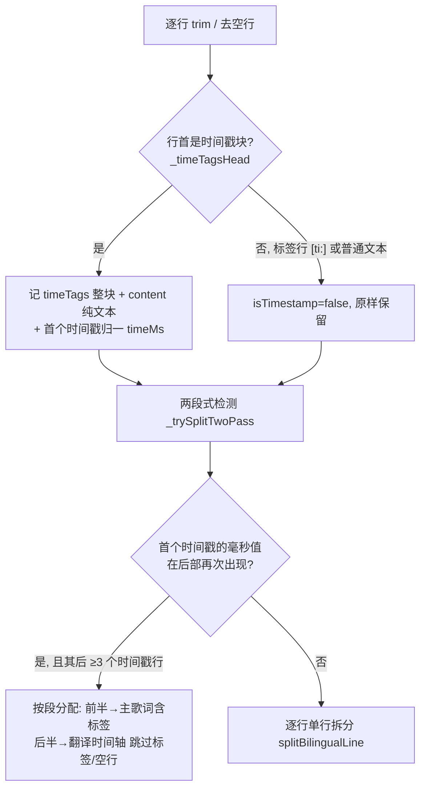
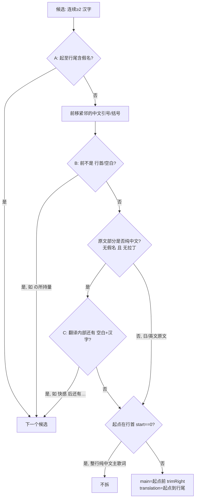

# 歌词解析与双语拆分

> 本文档是「约定 + 设计说明 + 索引」,不是代码副本。修改 `bilingual_lrc.dart` 的启发式或解析逻辑时,请同步更新本文与 `test/lyrics_split_test.dart`,避免与实现脱节。

⸻

## 1. 背景:为什么要自动拆「原文 + 翻译」

* **LRC 标准只有一条时间轴**。主歌词 + 翻译是各平台(QQ 音乐 / 网易云 / 酷狗…)自行扩展的**非标准**格式,各家约定不一,常见的混乱形态见 §4。
* 渲染库 `flutter_lyric` 的翻译副行需要**两条独立时间轴**:
  ```dart
  controller.loadLyric(mainLyric, translationLyric: translationLyric);
  ```
  它**不做自动拆分**,只负责把调用方给的两条文本按时间戳对齐渲染。
* 因此本 App 需要把用户拿到的**单个 `.lrc` 文件**先拆成两条时间轴,再喂给 `flutter_lyric`。
* **业界对比**(调研 2026-09-08):椒盐音乐、DsoMusic、BlackHole 等成熟播放器的「主 + 翻译」都来自**在线 API 的两个字段**(网易云 `lrc` / `tlyric`)或用户规范准备的「同时间戳分行」文件,源头从不混排,因此**不需要启发式拆分**;椒盐官方甚至明确「同行双语不处理,请用外部工具改格式」。我们是本地播放器、拿不到双字段,只能**在播放器内自动完成这份规范化**,这也是 `bilingual_lrc.dart` 存在的意义。

⸻

## 2. 相关文件与调用链

| 文件 | 职责 |
|---|---|
| `lib/core/utils/bilingual_lrc.dart` | 双语 LRC 自动拆分(**本文档核心**) |
| `lib/core/services/lyrics_view_model.dart` | 运行时调用方:读歌词 → 拆分 → `loadLyric` |
| `test/lyrics_split_test.dart` | 拆分逻辑回归测试(当前 18 例) |
| 依赖 `flutter_lyric` | 渲染,按时间戳对齐主/翻译 |

调用链(`lyrics_view_model.dart`):

```
读取歌词(内嵌优先 → resolveLrcPath 同名 .lrc 兜底)
   └─ 判断是否带时间轴: /^\[\d{1,}:\d{2}/m
        ├─ 否: 纯文本 → 降级为静态单行 LyricModel(不滚动高亮)
        └─ 是: splitBilingualLrc(content)
                  └─ controller.loadLyric(mainLyric, translationLyric: …)
```

⸻

## 3. 入口与对外接口

文件内**仅两个公开函数**,其余为正则/私有辅助:

| 函数 | 输入 → 输出 | 说明 |
|---|---|---|
| `splitBilingualLrc(lrc)` | 整首文本 → `(mainLyric, translationLyric)` | 整首拆分(两段式 or 单行) |
| `splitBilingualLine(content)` | 单行内容(去时间戳后) → `(main, translation)` | 单行「原文 翻译」拆分 |

⸻

## 4. 输入歌词的格式形态

| 形态 | 示例 | 处理路径 |
|---|---|---|
| 单语言 LRC(标准) | `[00:10.00]ただのテスト行` | 全进主歌词,无翻译 |
| **同行双语**(krc 转 lrc 常见) | `[00:13.45]あの日…秘め事は 那天我们唯一一次立下誓言…` | 单行拆分 → 两条时间轴 |
| **两段式**(QQ 音乐英文歌) | 前半英文时间轴 + 后半中文翻译时间轴,时间戳从头对齐 | 整首检测 → 按段整体分配 |
| **一行多时间戳**(网易云等) | `[00:00.00][00:05.00]xxx` | 主/翻译都保留全部时间戳前缀 |
| 纯文本(无时间轴) | 普通文本 | `lyrics_view_model` 降级静态单行 |
| 内嵌歌词 / 同名 `.lrc` | — | 由 `lyrics_view_model` 决定来源,不在此文件 |

⸻

## 5. 整首解析 `splitBilingualLrc`



* **标签行** `[ti:]/[ar:]…` 与普通文本行:整首未命中两段式时原样进主歌词;两段式的后半段会跳过它们。
* 拆出的两段时间轴仍各自保留原始时间戳字符串,由 `flutter_lyric` 负责按时间戳值对齐翻译(±10ms 容差),本文件**不重复实现渲染层对齐**。

### 5.1 两段式识别(按时间戳值对齐)

* 取**文件第一个时间戳行**的归一毫秒 `firstMs`;
* 从后部找第一个 `timeMs == firstMs` 的行作为翻译段起点(§6 归一规则保证 `[00:09.5]` 与 `[00:09.50]` 视为同一值);
* 防御:翻译段其后至少还有 ≥3 个时间戳行,避免把「单行重复」误判成两段式;
* 命中则调用 `_splitTwoPass` **按段整体分配,不再逐行拆分**——否则中文翻译行会被单行拆分再撕一次。

### 5.2 一行多时间戳

`_timeTagsHead` 匹配行首**连续时间戳块**(`(?:\[\d{1,}:\d{1,2}(?:[.:]\d{1,6})?\])+`),例如 `[00:00.00][00:05.00]xxx`:

* `timeTags` = `[00:00.00][00:05.00]`(原样整块),`content` = `xxx`(剥净);
* 单行拆分写回主/翻译时都用 `timeTags` 作前缀 → flutter_lyric 会把同一句歌词/翻译**展开到每个时间戳**,翻译不再只挂在第一个上。

⸻

## 6. 时间戳归一 `_timeTagToMs`

把单个时间戳 `mm:ss(.|:)frac` 归一到**毫秒**,用于两段式「值相等」比较:

```
ms = 分 × 60_000 + 秒 × 1_000 + frac → 毫秒
```

`frac` 按「秒的小数位」处理(与 flutter_lyric 一致):

| 输入 | 小数位处理 | ms |
|---|---|---|
| `[00:17.65]` | `65` 不足 3 位右补 0 → `650` | 17 650 |
| `[00:00:58]`(冒号,网易云) | `58` → `580` | 580 |
| `[00:09.5]` / `[00:09.50]` | 归一同值 | 9 500 |
| `[00:28.54449]`(>3 位) | 截断前 3 位 | 28 544 |

支持分钟任意位、秒 1-2 位、小数 1-6 位、点/冒号分隔。

⸻

## 7. 单行拆分启发式 `splitBilingualLine`(核心)

**目标**:给定一行内容(原文与翻译同行,共用一个时间戳),找出「翻译起点」,切成 `(main, translation)`。

**翻译的画像**:行内**最后一段、纯中文、前面有空白的连续汉字**。启发式遍历所有候选汉字串(`_hanziRun` = 连续 ≥2 汉字),第一个通过全部过滤的就是翻译起点:

| # | 过滤 | 规则 | 拦掉什么 |
|---|---|---|---|
| A | 后无假名 | 候选起至行尾不得含 `_kana`(平假名/片假名) | 日文原文里的汉字(幾億/残酷…)必带假名后缀 |
| — | 前移标点 | 候选前紧邻中文左引号/括号(`_cnPunct`)归入翻译 | 让 `「翻译` 的引号算进翻译 |
| B | 前须空白/行首 | 候选前一字符必须 `_blank`(Unicode 空白,含全角空格/thin space)或行首 | 日文句尾汉字名词(の**所持量**、う**督促状**)前是假名助词 |
| C | 翻译内部不得再有「空白+汉字」 | `_blankThenHanzi` 命中则排除;**仅当「原文为纯中文」时启用** | 中文原文同行(体感 即 快感 体感即**快感**)里的中间段 |
| — | start==0 | 起点在行首 → 整行即纯中文主歌词,不拆 | 中文歌整行被误当翻译 |

**过滤 C 的启用条件(2026-08-30 迭代后)**:

```
mainIsPureChinese = 原文部分(content[0:start]) 不含假名 且 不含拉丁字母
```

* 日文原文(含假名)、英文原文(含拉丁) → 翻译内部**常带空格分段**(夜风拂过 暗夜飘摇 轻奏音色 飘舞静寂 / 她走进来所踩的步伐 那时那刻我就察觉),必须停在**第一个翻译段**,不能启用 C;
* 纯中文原文(体感 即 快感 …)才需要 C 防中间段误切。



**判定顺序注意**:过滤 B(前须空白)与 C 在代码里都是 `continue` 跳过候选,继续找下一个;只有「前移标点」是回溯(把引号并进翻译后再判断起点是否在行首/空白之后)。

⸻

## 8. 正则一览

| 正则 | 匹配 | 用途 |
|---|---|---|
| `_kana` | `[\u3040-\u30ff]` | 假名(日文特征) |
| `_latin` | `[a-zA-Z]` | 拉丁字母(英文特征) |
| `_hanziRun` | `[\u4e00-\u9fff]{2,}` | 连续 ≥2 汉字(候选翻译起点) |
| `_cnPunct` | 中文引号/括号等 | 切分时归入翻译 |
| `_blank` | Unicode 空白(含 `\u3000` / thin space `\u2009`) | 原文/翻译分隔判定 |
| `_blankThenHanzi` | 空白 + 连续 ≥2 汉字 | 过滤 C(翻译内部是否还有段落) |
| `_timeTag` | `^(\d+):(\d{1,2})(?:[.:](\d{1,6}))?$` | 单个时间戳校验/解析 |
| `_timeTagsHead` | `^((?:\[\d…\])+)\s*(.*)$` | 行首连续时间戳块 + 内容 |
| `_timeTagInBlock` | `\[(\d…)\]` | 从块里取第一个时间戳 |

⸻

## 9. 已知边界与取舍

* 纯中文双词短句同行(如 `甲乙 丙丁`)会被拆成「原文 + 翻译」——无法与「中文原文 + 中文翻译」同行可靠区分,接受。
* 含假名/拉丁的原文行若「以两个汉字名词并列结尾且后接翻译」(如 `未来 世界 你的未来 是世界`)可能把第二个名词当翻译起点,罕见,接受。
* 两段式检测依赖「首个时间戳在后部再次出现」:若翻译段起始时间戳与原文段不一致(极罕见)会检测不到,退回逐行拆分。
* 内嵌歌词仅 MP3/FLAC、需 UTF-8(由读取层负责),不在此文件范围。
* 本文件只拆「主 / 翻译」两轴,不处理逐字(QRC 带词级时间)歌词的翻译。

⸻

## 10. 测试覆盖( `test/lyrics_split_test.dart` ,18 例)

| 分组 | 覆盖点 |
|---|---|
| `splitBilingualLine` 单行 | 基本日+中 / 「」内部空格 / 汉字结尾(事/程)不误切 / 连续汉字(幾億/残酷)不误切 / 纯日文无翻译 / 纯中文整行不拆 / 英文混排 |
| 单行回归 | Bug2:日文句尾汉字名词(所持量/督促状)不误拆 / Bug1:纯汉字同行 thin space 拆分 / 日文句尾名词+后接翻译只拆翻译 / 日文+空格分段翻译 / 英文+空格分段翻译 |
| `splitBilingualLrc` 整首 | 标签保留+双轴 / 无翻译为空 / 中文歌保留主歌词 / 两段式按段整体拆分 / 一行多时间戳保留 / 两段式毫秒位数不一致识别 |

**约定**:新加启发式/新发现格式 → 先补这里一条回归,再改实现。

⸻

## 11. 演进记录

| 日期 | 变更 |
|---|---|
| 2026-08-19 | 初始单行启发式:找「连续≥2汉字且其后无假名」作翻译起点;纯中文行不拆 |
| 2026-08-27 | 加固:翻译起点前须空白/行首;翻译内部不得有空白+汉字(修 Bug1 纯汉字同行、Bug2 日文句尾名词) |
| 2026-08-29 | 新增两段式 LRC 支持(时间戳重复 → 按段分配,避免逐行误拆) |
| 2026-08-30 | 判据迭代:过滤 C 仅在「原文为纯中文」启用(日文→英文空格分段翻译逐步修复) |
| 2026-09-08 | 一行多时间戳支持;两段式改按时间戳值(毫秒归一)对齐 |

⸻

## 12. 相关链接

* 渲染:依赖 `flutter_lyric`(`loadLyric(mainLyric, translationLyric:)`,按时间戳 ±10ms 对齐)
* 运行时歌词加载/降级:`lib/core/services/lyrics_view_model.dart`
* 错误处理与日志总约定:`docs/ErrorHandling.md`
